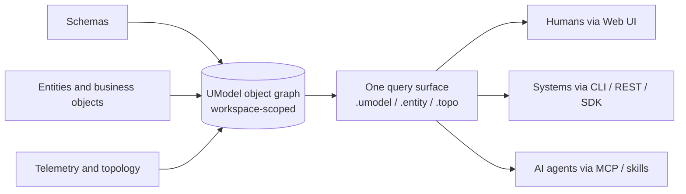

# UModel

[](https://github.com/alibaba/UnifiedModel/actions/workflows/ci.yml)


中文版本：[README_CN.md](README_CN.md)

**The open-source semantic layer for AI, data governance, and operations.** UModel turns fragmented schemas, entities, telemetry, and topology into one workspace-scoped **object graph** that humans, systems, and AI agents read through a single query surface — vendor-neutral, run locally.

Most AI and analytics work stalls not on missing data but on data with no shared *meaning*. UModel is the layer that supplies it: a live, queryable semantic runtime instead of a passive data dictionary.

## See it

<video src="https://unifiedmodel-assets.oss-accelerate.aliyuncs.com/QuickStart.mp4" controls width="800"></video>

A 90-second demo — an AI agent reads across the object graph in the `quickstart-multidomain` workspace: it discovers services, walks cross-domain topology, and pulls metrics and logs through model-scoped query plans, without hand-writing a single query. If the player doesn't load, [watch the clip directly](https://unifiedmodel-assets.oss-accelerate.aliyuncs.com/QuickStart.mp4).

## How it works

UModel sits between scattered sources and the people, systems, and agents that need to make sense of them. Author the meaning once; everyone reads it the same way.



With UModel you:

- **Author and import model packs** that define enterprise objects, operational objects, datasets, links, storage, and topology semantics.
- **Query** models, entities, and topology through one SPL surface — `.umodel`, `.entity`, `.topo` — over CLI, REST, or MCP.
- **Explore** the workspace through a local Web UI.
- **Connect agents** through AgentGateway and MCP, and let the model auto-scope reads (metrics/logs query plans) instead of hand-writing them.

## Why UModel

- **Accelerate enterprise AI at scale.** A unified semantic standard lets AI understand data meaning across platforms, departments, and tools — a faster path to operations, analytics, prediction, and agent workflows.
- **Cut data-governance cost.** A shared language for multi-source data frees teams from repetitive metric alignment, field translation, and context reconstruction.
- **Stay vendor-neutral.** UModel is independent of any single platform, data tool, observability stack, or AI vendor, so you avoid semantic lock-in.
- **Build a semantic operating system.** A live, programmable runtime that agents query and reason over — shared context for multi-agent collaboration, not a static dictionary.

## Project Scope

This repository includes the local UModel service, `umctl` CLI, MCP server, OpenAPI contract, React Web UI, generated SDK assets, example packs, Docker/Compose assets, and test suites.

The open-source core focuses on local operation, public contracts, semantic modeling, agent integration, and contributor-friendly extension points. Cloud-hosted control planes, multi-tenant authorization, Aliyun internal frontend packages, and domain-specific read APIs outside Query Service are outside the public core.

## Five-Minute Quick Start

Requirements: Go 1.22+, Make, Node.js 22+ (Web UI), and pnpm 9+ preferred (`corepack` / `npm exec` fallback supported).

Check the local toolchain, then start the API and Web UI with a preloaded demo workspace:

```bash
make check-env
make quickstart
```

`make quickstart` starts a local API, starts the Web UI, preloads the `demo` workspace with `GRAPHSTORE=memory`, and leaves no local demo data behind after the process stops.

Next steps:

- Open `http://localhost:5173`, select `demo`, and inspect the workspace through Explorer, Query, Data Store, and Agent views.
- Integrate an agent through AgentGateway or MCP: `umctl agent discover demo`, then connect an MCP client through `umodel-mcp`.
- Query models, entities, and topology through CLI or REST using Query Service.
- Want the agent reading **real** metrics and logs? Bring up the telemetry-backed stack — `sh examples/quickstart-multidomain/deploy/start.sh` — and point the [`umodel-query`](skills/umodel-query) skill at it.

Stop local services with `make stop-all`. Detailed flows: [Quick Start](docs/en/getting-started/quickstart.md) · [Web UI](docs/en/guides/web-ui.md) · [Query Service](docs/en/guides/query-service.md) · [MCP](docs/en/reference/mcp.md).

## Agent Skills

Loadable skills let a skill-aware agent drive UModel directly — read entities, relations, topology, and the model itself, then run model-guided root-cause analysis over the object graph. In Claude Code, install both skills in one command:

```
/plugin marketplace add alibaba/UnifiedModel
/plugin install umodel@unifiedmodel
```

Qoder, Codex, Cursor, and other agents load the same two `SKILL.md` files — copy them into the agent's skills directory (`.qoder/skills/` for Qoder, `.agents/skills/` for Codex, `.claude/skills/` for Claude Code). See [Agent Skills](skills/README.md) for the catalog and [the skills quickstart](skills/QUICKSTART.md) for per-agent install.

## Architecture


UModel runs as a local service around one workspace-scoped object graph:

- Model packs define the object vocabulary: EntitySets, datasets, links, storage, and relation semantics.
- EntityStore writes runtime entities and topology relations that instantiate the model.
- Query Service is the unified read surface for `.umodel`, `.entity`, and `.topo`.
- AgentGateway and MCP expose discovery, resources, query examples, and safe tools for agent clients.
- Web UI, CLI, REST, and SDK clients operate against the same public contracts.

Details: [Overview](docs/en/architecture/overview.md) · [Runtime Flow](docs/en/architecture/runtime-flow.md) · [Query And Agent](docs/en/architecture/query-and-agent.md).

## Documentation

Start with the bilingual documentation index: [docs/README.md](docs/README.md).

| Area | Entry |
|---|---|
| Getting started | [Installation](docs/en/getting-started/installation.md), [Quick Start](docs/en/getting-started/quickstart.md) |
| Concepts | [Concepts Index](docs/en/concepts/index.md), [Object Graph Semantic Layer](docs/en/concepts/object-graph-semantic-layer.md) |
| Guides | [Model Authoring](docs/en/guides/model-authoring.md), [Entity And Relation Writes](docs/en/guides/entity-relation-writes.md), [Query Service](docs/en/guides/query-service.md), [Web UI](docs/en/guides/web-ui.md), [SDK And Client Guide](docs/en/guides/sdk-clients.md) |
| Architecture | [Architecture Overview](docs/en/architecture/overview.md), [Runtime Flow](docs/en/architecture/runtime-flow.md), [Query And Agent Architecture](docs/en/architecture/query-and-agent.md) |
| Reference | [CLI](docs/en/reference/cli.md), [MCP](docs/en/reference/mcp.md), [REST OpenAPI](api/openapi/openapi.yaml), [MCP Tool And Resource Schema](api/mcp/tools.schema.json) |
| Examples | [Multi-Domain Quickstart Example Pack](examples/quickstart-multidomain/README.md), [Incident Investigation Demo (AI agent)](examples/incident-investigation/README.md), [Service Localization Demo (AI agent)](examples/service-localization/README.md) |
| Agent Skills | [UModel Agent Skills](skills/README.md) — loadable skills for MCP/CLI agents: read entity/relation/model data and run model-guided root-cause analysis |
| Deployment | [Docker And Compose](deployments/README.md) |

Chinese documentation: [docs/zh/README.md](docs/zh/README.md).

## Development

```bash
make install-env     # install local dependencies
make build           # build service, UI, and Go SDK
make ci              # run the local CI gate
```

Focused checks: `make guard`, `make test-service`, `make verify`, `make example-validate`. Generated Go and Python model SDKs live under `sdk/`; the Java SDK remains under `generated/java/`. The minimal Go service client lives under `sdk/go/service`.

## GraphStore Providers

Runtime GraphStore providers are selected with `--graphstore`.

| Provider | Typical use |
|---|---|
| `memory` | Ephemeral local tests and quickstart demos. Data is lost after process exit. |
| `file.memory` | JSON persistence under `--data`. Default for `make dev`, Docker, and Compose. |
| `local.ladybug` | Ladybug-backed environments. Requires `-tags ladybug` and a local Ladybug runtime. |

Provider details: [GraphStore Providers](docs/en/graphstore-providers.md).

## Governance And Support

- License: [Apache-2.0](LICENSE)
- Contributions: [CONTRIBUTING.md](CONTRIBUTING.md)
- Security policy: [SECURITY.md](SECURITY.md)
- Support channels: [SUPPORT.md](SUPPORT.md)
- Code of conduct: [CODE_OF_CONDUCT.md](CODE_OF_CONDUCT.md)
- Changelog: [CHANGELOG.md](CHANGELOG.md)
