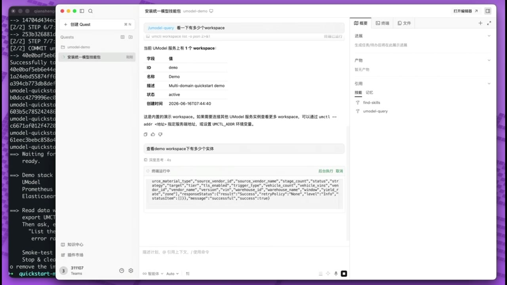
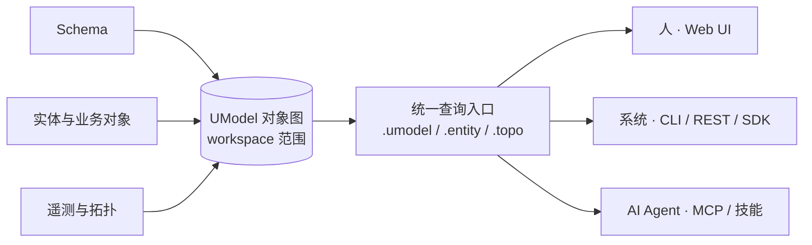

# UModel

[](https://github.com/alibaba/UnifiedModel/actions/workflows/ci.yml)


English version: [README.md](README.md)

**面向 AI、数据治理与运维的开源语义层。** UModel 把分散的 schema、实体、遥测和拓扑，组织成一张 workspace 范围的**对象图**——人、系统和 AI Agent 都通过同一个查询入口读取它，厂商中立、本地运行。

AI 与分析卡住，往往不是因为缺数据，而是数据缺少共享的*语义*。UModel 就是补上语义的那一层：一个活的、可查询的语义运行时，而不是被动查阅的数据辞典。

## 看一眼

[](https://unifiedmodel-assets.oss-cn-hangzhou.aliyuncs.com/QuickStart.mp4)

一段 90 秒的演示：AI Agent 在 `quickstart-multidomain` workspace 上读取对象图——发现服务、沿跨域拓扑遍历、并通过模型自动生成的查询计划拉取指标和日志，全程不手写一条查询。（[观看完整视频](https://unifiedmodel-assets.oss-cn-hangzhou.aliyuncs.com/QuickStart.mp4)）

## 工作原理

UModel 位于分散的数据源与需要理解它们的人、系统、Agent 之间。语义只编写一次，所有人用同一种方式读取。



用 UModel，你可以：

- **编写和导入模型包**，定义企业对象、运维对象、数据集、链接、存储和拓扑语义。
- **查询**模型、实体和拓扑——通过 `.umodel`、`.entity`、`.topo` 一组 SPL 入口，走 CLI、REST 或 MCP。
- **探索** workspace，通过本地 Web UI。
- **接入 Agent**，通过 AgentGateway 和 MCP，让模型自动生成取数计划（指标/日志），而不是手写查询。

## 为什么需要 UModel

- **加速企业 AI 规模化落地。** 统一语义标准让 AI 跨平台、跨部门、跨工具理解数据含义——更快走向运维、分析、预测和 Agent 工作流。
- **降低数据治理成本。** 多源数据共享同一套语义语言，数据团队不再反复消耗在口径对齐、字段翻译和上下文重建上。
- **保持厂商中立。** UModel 独立于任何单一平台、数据工具、可观测栈或 AI 供应商，避免语义层面的厂商锁定。
- **构建语义操作系统。** 一个活的、可编程的语义运行时，供 Agent 查询与推理——面向多智能体协作的共享上下文，而不是静态辞典。

## 项目范围

本仓库包含本地 UModel 服务、`umctl` CLI、MCP server、OpenAPI 契约、React Web UI、生成 SDK 资产、示例包、Docker/Compose 资产和测试套件。

开源核心聚焦本地运行、公共契约、语义建模、Agent 集成和 contributor-friendly 扩展点。Cloud-hosted control plane、multi-tenant authorization、Aliyun 内部前端包，以及 Query Service 之外的领域专用读取 API 不属于公共核心。

## 五分钟快速开始

依赖：Go 1.22+、Make、Node.js 22+（Web UI），首选 pnpm 9+（支持 `corepack` / `npm exec` fallback）。

检查本地工具链，然后启动 API 和 Web UI 并预加载 demo workspace：

```bash
make check-env
make quickstart
```

`make quickstart` 会启动本地 API、启动 Web UI，并用 `GRAPHSTORE=memory` 预加载 `demo` workspace；进程停止后不保留本地 demo 数据。

下一步：

- 打开 `http://localhost:5173`，选择 `demo`，通过 Explorer、Query、Data Store 和 Agent 视图查看 workspace。
- 通过 AgentGateway 或 MCP 集成 Agent：`umctl agent discover demo`，再通过 `umodel-mcp` 连接 MCP client。
- 通过 CLI 或 REST 使用 Query Service 查询模型、实体和拓扑。
- 想让 Agent 读取**真实**的指标和日志？拉起带遥测后端的 stack——`sh examples/quickstart-multidomain/deploy/start.sh`——再把 [`umodel-query`](skills/umodel-query) 技能指向它。

用 `make stop-all` 停止本地服务。详细流程：[快速开始](docs/zh/getting-started/quickstart.md) · [Web UI](docs/zh/guides/web-ui.md) · [Query Service](docs/zh/guides/query-service.md) · [MCP](docs/zh/reference/mcp.md)。

## Agent 技能

可加载的技能让支持技能的 Agent 直接驱动 UModel——读取实体、关系、拓扑和模型本身，并在对象图上做模型引导的根因分析。在 Claude Code 里，一条命令装上两个技能：

```
/plugin marketplace add alibaba/UnifiedModel
/plugin install umodel@unifiedmodel
```

Qoder、Codex、Cursor 等 Agent 加载同样的两个 `SKILL.md` 文件——把它们拷进对应 Agent 的技能目录（Qoder 用 `.qoder/skills/`，Codex 用 `.agents/skills/`，Claude Code 用 `.claude/skills/`）。技能目录见 [UModel Agent 技能](skills/README.zh-CN.md)，分平台安装见 [技能快速上手](skills/QUICKSTART.zh-CN.md)。

## 架构


UModel 围绕一张 workspace 范围的对象图运行本地服务：

- 模型包定义对象词汇：EntitySet、数据集、链接、存储和关系语义。
- EntityStore 写入运行时实体与拓扑关系，实例化模型。
- Query Service 是 `.umodel`、`.entity`、`.topo` 的统一读取入口。
- AgentGateway 和 MCP 为 Agent client 暴露 discovery、resources、query examples 和安全工具。
- Web UI、CLI、REST 和 SDK client 共享同一套公开契约。

细节：[架构总览](docs/zh/architecture/overview.md) · [运行时流程](docs/zh/architecture/runtime-flow.md) · [Query 与 Agent](docs/zh/architecture/query-and-agent.md)。

## 文档

从双语文档索引开始：[docs/README.md](docs/README.md)。

| 领域 | 入口 |
|---|---|
| 入门 | [安装](docs/zh/getting-started/installation.md)、[快速开始](docs/zh/getting-started/quickstart.md) |
| 概念 | [概念索引](docs/zh/concepts/index.md)、[对象图语义层](docs/zh/concepts/object-graph-semantic-layer.md) |
| 指南 | [模型编写](docs/zh/guides/model-authoring.md)、[实体与关系写入](docs/zh/guides/entity-relation-writes.md)、[Query Service](docs/zh/guides/query-service.md)、[Web UI](docs/zh/guides/web-ui.md)、[SDK 与客户端](docs/zh/guides/sdk-clients.md) |
| 架构 | [架构总览](docs/zh/architecture/overview.md)、[运行时流程](docs/zh/architecture/runtime-flow.md)、[Query 与 Agent 架构](docs/zh/architecture/query-and-agent.md) |
| 参考 | [CLI](docs/zh/reference/cli.md)、[MCP](docs/zh/reference/mcp.md)、[REST OpenAPI](api/openapi/openapi.yaml)、[MCP Tool 和 Resource Schema](api/mcp/tools.schema.json) |
| 示例 | [多域 Quickstart 示例包](examples/quickstart-multidomain/README.zh-CN.md)、[故障排查 Demo（AI Agent）](examples/incident-investigation/README.zh-CN.md)、[服务定位 Demo（AI Agent）](examples/service-localization/README.zh-CN.md) |
| Agent 技能 | [UModel Agent 技能](skills/README.zh-CN.md) —— 可加载给 MCP/CLI Agent 的技能：读实体/关系/模型数据，做模型引导的根因分析 |
| 部署 | [Docker 与 Compose](deployments/README.zh-CN.md) |

英文文档：[docs/en/README.md](docs/en/README.md)。

## 开发

```bash
make install-env     # 安装本地依赖
make build           # 构建服务、UI 和 Go SDK
make ci              # 运行本地 CI gate
```

定向检查：`make guard`、`make test-service`、`make verify`、`make example-validate`。生成的 Go 和 Python 模型 SDK 位于 `sdk/`；Java SDK 仍在 `generated/java/`。最小 Go service client 位于 `sdk/go/service`。

## GraphStore Providers

运行时 GraphStore provider 通过 `--graphstore` 选择。

| Provider | 典型用途 |
|---|---|
| `memory` | 临时本地测试和 quickstart demo。进程退出后数据丢失。 |
| `file.memory` | `--data` 下的 JSON 持久化。这是 `make dev`、Docker 和 Compose 的默认值。 |
| `local.ladybug` | Ladybug-backed 环境。需要 `-tags ladybug` 和本地 Ladybug runtime。 |

Provider 细节：[GraphStore Providers](docs/zh/graphstore-providers.md)。

## 治理与支持

- License: [Apache-2.0](LICENSE)
- 贡献：[CONTRIBUTING.zh-CN.md](CONTRIBUTING.zh-CN.md)
- 安全策略：[SECURITY.zh-CN.md](SECURITY.zh-CN.md)
- 支持渠道：[SUPPORT.zh-CN.md](SUPPORT.zh-CN.md)
- 行为准则：[CODE_OF_CONDUCT.zh-CN.md](CODE_OF_CONDUCT.zh-CN.md)
- 变更日志：[CHANGELOG.zh-CN.md](CHANGELOG.zh-CN.md)
